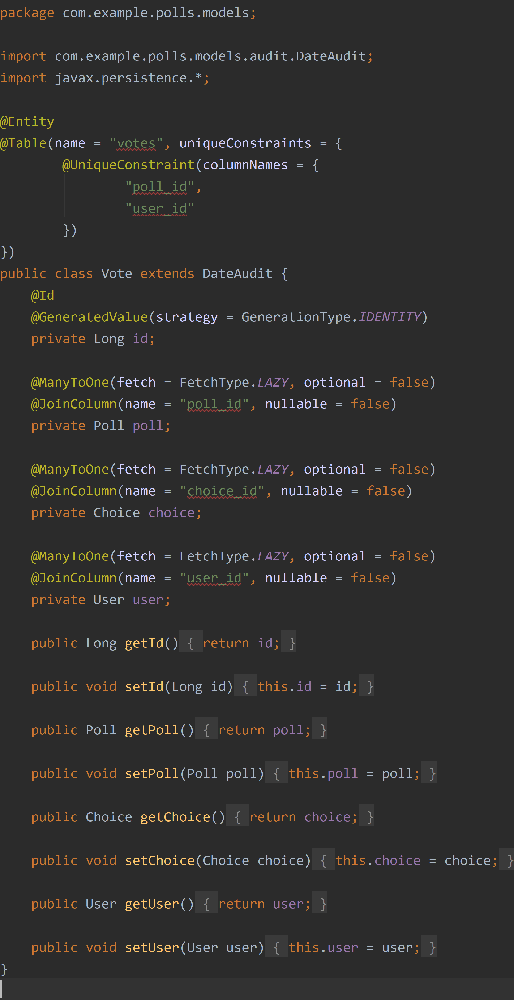

### Polls App
#### Create polls with ease
Create polls, get vote count with authentication system, which allows users to register and login
  
### Basic information regarding the application:

Purpose of the project
The purpose of the project was to develop a self-explanatory REST API Interface with an authentication system that would simplify the creation of polls and counting their votes. Because of REST architecture API is compatible with almost every modern front-end and mobile framework and can be used as Polling app or Polling Site, behavior similar to change.org, but instead of petition creation, an interface will allow the creation of polls.

## More information
If you want more information about API endpoints and their specification, please visit - Documentation If have postman desktop app, you can test all requests locally.

In this documentation, I will show the inside parts of the project step by step, explaining each part of the polling system. If you want to run a local version of the project you need to satisfy the following software requirements.

Originally the project was run and tested on IntelliJ IDEA, but if you don't want to use it there are other IDE's or you can run the project from the console.

Primary:

Java SDK 8 
Postgresql 11 or higher
Optional:

IntelliJ IDEA (For easier development and project start) - Comunity Version
### Configuration
After a successful installation configure the project to use your database and user, this can be done in application.properties file, change their properties to:

spring.datasource.url= jdbc:postgresql://localhost:5432/{your_db_name}
spring.datasource.username= {your_db_user}
spring.datasource.password= {db_user_pass}
## Deployment
The project is deployed on a free node of Heroku, but there is no use of visiting it because of token requirements no available browsable API in Spring Boot.

### Note:
This repo contains Server Part written in Spring Boot

Detailed information about all endpoints and their specification can be found [here](https://documenter.getpostman.com/view/6754479/Szt8covo?version=latest#35a2fc61-8988-4c78-9ec3-7f779e53dee2),
documentation was created using Postman, if you have postman desktop app you can try all requests and test them out.

## Models

Model is the single, definitive source of information about your data. It contains the essential fields and behaviors of the data you’re storing. Generally, each model maps to a single database table, they are the core of the polls app, so I decided to first start with them.

User model: Our application allows new users to register and login to our application. Every User will have one or more roles. The roles associated with a user will be used to decide whether the user is authorized to access a particular resource on our server or not. The User model contains the following fields -

id: Primary Key
username: A unique username
email: A unique email
password: A password that will be stored in an encrypted format.
roles: A set of roles. (Many-To-Many relationship with Role entity)

# IMAGE 1

Role model: The Role class contains an

id: Primary Key
name: String field.
The name field is an enum. We’ll have a fixed set of pre-defined roles. So it makes sense to make the role name as enum.

# IMAGE 2

Poll model: A poll is used to represent poll table in the database and has an

id: Primary Key
question: String field
choices: OneToMany related field with Choice model
expirationDateTime: Instant DateTime

# IMAGE 3

Choice model: Every Poll choice has an

id: Primary Key
text: String field
and related to a Poll via a foreign key relationship.

# IMAGE 4

Vote model The Vote class contains information about which user voted for which choice in a poll.

#  IMAGE 5

